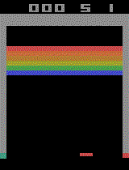

# DQN-PyTorch-Breakout
## Overview
An attempt at recreating [DeepMind's implementation of Deep Q Learning on Atari Breakout](https://arxiv.org/pdf/1312.5602v1.pdf) using PyTorch.

## Dependencies
* PyTorch
* [OpenAI Gym](https://github.com/openai/gym)
* Pillow
* Numpy

## Example of a trained agent playing Breakout

